# Flujograma integral de la plataforma ASI

> Mapa completo de procesos, lógica y pipelines de la plataforma: superficies, sesión/permisos,
> gating, y los recorridos de **miembro/candidato**, **pastor**, **admin** y **empleador**, desde el
> registro hasta el cierre de sesión.
>
> Los diagramas están en **Mermaid** (se renderizan en GitHub, VS Code con extensión Mermaid, y la
> mayoría de visores de Markdown). Generado el 2026-06-22 a partir del código real.
>
> 🗂️ **Validar arquitectura:** cada sección enlaza a la estructura real de sus tablas en
> **[Arquitectura de base de datos →](arquitectura-db.md)** (campos, tipos, FKs de las 52 tablas).

---

## 0. Índice

1. [Mapa de superficies y shells](#1-mapa-de-superficies-y-shells)
2. [Modelo de sesión, roles y permisos](#2-modelo-de-sesión-roles-y-permisos)
3. [Guards de acceso (enforcement)](#3-guards-de-acceso-enforcement)
4. [Journey maestro de un usuario (registro → logout)](#4-journey-maestro-de-un-usuario)
5. [Auth, onboarding y redirección de entrada](#5-auth-onboarding-y-redirección-de-entrada)
6. [Gating del ATS (acceso a la plataforma)](#6-gating-del-ats)
7. [Pipeline de membresía (carril principal)](#7-pipeline-de-membresía)
8. [Flujo del MIEMBRO (panel de progreso)](#8-flujo-del-miembro)
9. [Flujo del PASTOR](#9-flujo-del-pastor)
10. [Flujo del ADMIN](#10-flujo-del-admin)
11. [Conversión a EMPLEADOR (recruiter request)](#11-conversión-a-empleador)
12. [Flujo de EMPLEO (jobs + aplicaciones + pipeline)](#12-flujo-de-empleo)
13. [Máquinas de estado (todas)](#13-máquinas-de-estado)
14. [Navegación por rol (qué ve cada quién)](#14-navegación-por-rol)
15. [Matriz de permisos y RPCs](#15-matriz-de-permisos-y-rpcs)

---

## 1. Mapa de superficies y shells

La app se divide en **superficies** (zonas con su propio shell/layout). Una sola persona puede ver
varias según su estado y permisos.

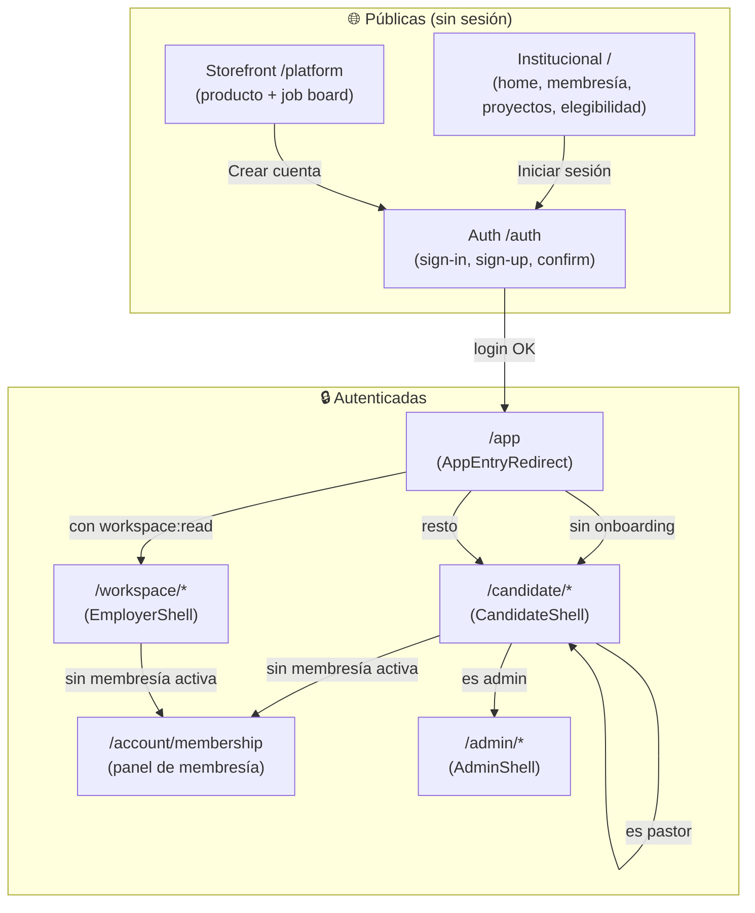
```mermaid
flowchart TB
    subgraph PUB["🌐 Públicas (sin sesión)"]
        INST["Institucional /<br/>(home, membresía, proyectos, elegibilidad)"]
        STORE["Storefront /platform<br/>(producto + job board)"]
        AUTH["Auth /auth<br/>(sign-in, sign-up, confirm)"]
    end

    subgraph AUTHED["🔒 Autenticadas"]
        ENTRY["/app<br/>(AppEntryRedirect)"]
        MEMB["/account/membership<br/>(panel de membresía)"]
        CAND["/candidate/*<br/>(CandidateShell)"]
        WORK["/workspace/*<br/>(EmployerShell)"]
        ADMIN["/admin/*<br/>(AdminShell)"]
    end

    INST -->|"Iniciar sesión"| AUTH
    STORE -->|"Crear cuenta"| AUTH
    AUTH -->|"login OK"| ENTRY
    ENTRY -->|"sin onboarding"| CAND
    ENTRY -->|"con workspace:read"| WORK
    ENTRY -->|"resto"| CAND
    CAND -->|"sin membresía activa"| MEMB
    WORK -->|"sin membresía activa"| MEMB
    CAND -->|"es admin"| ADMIN
    CAND -->|"es pastor"| CAND
```

**Shells (layouts):**

| Shell | Ruta | Quién |
|---|---|---|
| `InstitutionalShell` | `/` | Público (sitio institucional ASI) |
| `StorefrontShell` | `/platform` | Público (producto + empleos) |
| `AuthShell` | `/auth` | Sin sesión |
| `CandidateShell` (= `PlatformAppShell`) | `/candidate` + `/account/membership` | Todo usuario autenticado |
| `EmployerShell` (= `PlatformAppShell`) | `/workspace` | Con `workspace:read` |
| `AdminShell` | `/admin` | Con acceso a consola admin |

> **Sidebar unificado**: `CandidateShell`/`EmployerShell` comparten `PlatformAppShell`, que SUMA
> grupos al sidebar según el usuario: `Tu espacio` (base) + `Pastoral` (si pastor) + `Mi empresa`
> (si `workspace:read`) + `Administración` (si admin) + `Cuenta`.

---

## 2. Modelo de sesión, roles y permisos

Al iniciar sesión, `AppSessionProvider` hidrata un **snapshot** que decide todo el acceso.

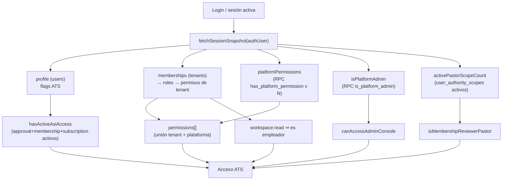
```mermaid
flowchart TB
    LOGIN["Login / sesión activa"] --> HYDRATE["fetchSessionSnapshot(authUser)"]
    HYDRATE --> P1["profile (users)<br/>flags ATS"]
    HYDRATE --> P2["memberships (tenants)<br/>→ roles → permisos de tenant"]
    HYDRATE --> P3["platformPermissions<br/>(RPC has_platform_permission x N)"]
    HYDRATE --> P4["isPlatformAdmin<br/>(RPC is_platform_admin)"]
    HYDRATE --> P5["activePastorScopeCount<br/>(user_authority_scopes activos)"]

    P1 --> S1["hasActiveAsiAccess<br/>(approval+membership+subscription activos)"]
    P2 --> S2["permissions[]<br/>(unión tenant + plataforma)"]
    P3 --> S2
    P4 --> S3["canAccessAdminConsole"]
    P2 --> S4["workspace:read ⇒ es empleador"]
    P5 --> S5["isMembershipReviewerPastor"]

    S1 --> ACCESS["Acceso ATS"]
    S2 --> ACCESS
    S3 --> ACCESS
    S4 --> ACCESS
    S5 --> ACCESS
```

**Tres capas de autorización (independientes):**

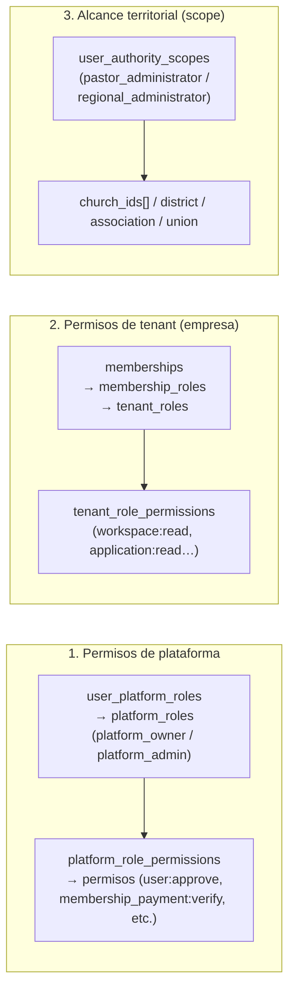
```mermaid
flowchart LR
    subgraph L1["1. Permisos de plataforma"]
        direction TB
        PA["user_platform_roles<br/>→ platform_roles<br/>(platform_owner / platform_admin)"]
        PB["platform_role_permissions<br/>→ permisos (user:approve,<br/>membership_payment:verify, etc.)"]
    end
    subgraph L2["2. Permisos de tenant (empresa)"]
        direction TB
        TA["memberships<br/>→ membership_roles<br/>→ tenant_roles"]
        TB2["tenant_role_permissions<br/>(workspace:read, application:read…)"]
    end
    subgraph L3["3. Alcance territorial (scope)"]
        direction TB
        SA["user_authority_scopes<br/>(pastor_administrator /<br/>regional_administrator)"]
        SB["church_ids[] / district / association / union"]
    end
    PA --> PB
    TA --> TB2
    SA --> SB
```

> **Clave**: el pastor **no** usa permisos para revisar; autoriza por `user_authority_scope` sobre la
> iglesia (validado dentro de los RPCs security-definer). El admin sí usa permisos de plataforma.

🗂️ **Estructura de tablas:** [`users`](arquitectura-db.md#users) · [`user_platform_roles`](arquitectura-db.md#user_platform_roles) · [`platform_roles`](arquitectura-db.md#platform_roles) · [`platform_role_permissions`](arquitectura-db.md#platform_role_permissions) · [`permissions`](arquitectura-db.md#permissions) · [`memberships`](arquitectura-db.md#memberships) · [`membership_roles`](arquitectura-db.md#membership_roles) · [`tenant_roles`](arquitectura-db.md#tenant_roles) · [`tenant_role_permissions`](arquitectura-db.md#tenant_role_permissions) · [`user_authority_scopes`](arquitectura-db.md#user_authority_scopes)

---

## 3. Guards de acceso (enforcement)

Cada ruta autenticada pasa por una cadena de guards.

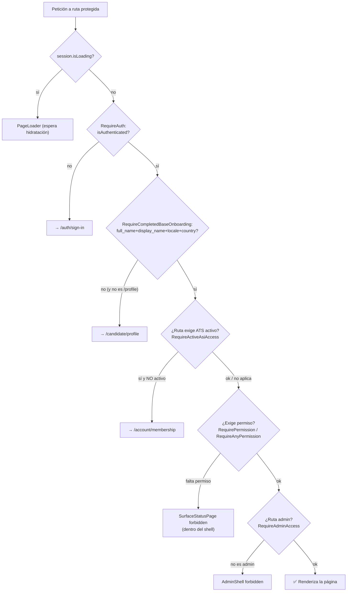
```mermaid
flowchart TB
    REQ["Petición a ruta protegida"] --> G0{"session.isLoading?"}
    G0 -->|"sí"| LOAD["PageLoader (espera hidratación)"]
    G0 -->|"no"| G1{"RequireAuth:<br/>isAuthenticated?"}
    G1 -->|"no"| SIGNIN["→ /auth/sign-in"]
    G1 -->|"sí"| G2{"RequireCompletedBaseOnboarding:<br/>full_name+display_name+locale+country?"}
    G2 -->|"no (y no es /profile)"| PROFILE["→ /candidate/profile"]
    G2 -->|"sí"| G3{"¿Ruta exige ATS activo?<br/>RequireActiveAsiAccess"}
    G3 -->|"sí y NO activo"| MEMBPANEL["→ /account/membership"]
    G3 -->|"ok / no aplica"| G4{"¿Exige permiso?<br/>RequirePermission / RequireAnyPermission"}
    G4 -->|"falta permiso"| FORBID["SurfaceStatusPage forbidden<br/>(dentro del shell)"]
    G4 -->|"ok"| G5{"¿Ruta admin?<br/>RequireAdminAccess"}
    G5 -->|"no es admin"| FORBIDADMIN["AdminShell forbidden"]
    G5 -->|"ok"| RENDER["✅ Renderiza la página"]
```

| Guard | Falla → | Usado en |
|---|---|---|
| `RequireAuth` | `/auth/sign-in` | Todo `/app`, `/account`, `/candidate`, `/workspace`, `/admin` |
| `RequireCompletedBaseOnboarding` | `/candidate/profile` | Shells autenticados |
| `RequireActiveAsiAccess` | `/account/membership` | `/candidate/applications`, `/workspace/*` |
| `RequirePermission` | `forbidden` en shell | Rutas con permiso único |
| `RequireAnyPermission` | `forbidden` en shell | `/admin/approvals` |
| `RequireAdminAccess` | `forbidden` admin | Todo `/admin` |

---

## 4. Journey maestro de un usuario

Recorrido completo: desde llegar al sitio hasta cerrar sesión, cubriendo las bifurcaciones por rol.

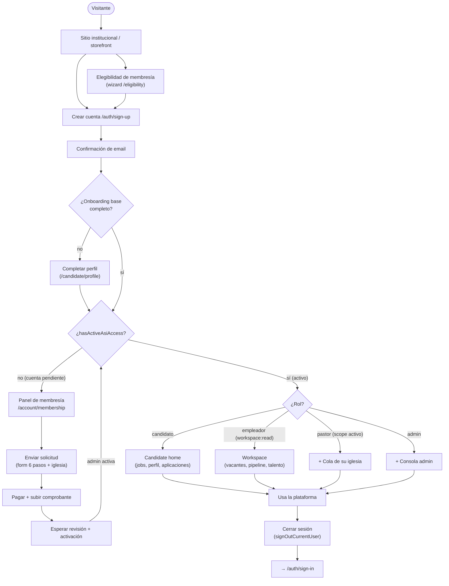
```mermaid
flowchart TD
    START(["Visitante"]) --> SITE["Sitio institucional / storefront"]
    SITE --> ELIG["Elegibilidad de membresía<br/>(wizard /eligibility)"]
    SITE --> SIGNUP["Crear cuenta /auth/sign-up"]
    ELIG --> SIGNUP

    SIGNUP --> CONFIRM["Confirmación de email"]
    CONFIRM --> ONB{"¿Onboarding base<br/>completo?"}
    ONB -->|"no"| PROFILE["Completar perfil<br/>(/candidate/profile)"]
    PROFILE --> GATE
    ONB -->|"sí"| GATE{"¿hasActiveAsiAccess?"}

    GATE -->|"no (cuenta pendiente)"| MPANEL["Panel de membresía<br/>/account/membership"]
    MPANEL --> APPLY["Enviar solicitud<br/>(form 6 pasos + iglesia)"]
    APPLY --> PAY["Pagar + subir comprobante"]
    PAY --> WAIT["Esperar revisión + activación"]
    WAIT -->|"admin activa"| GATE

    GATE -->|"sí (activo)"| HOME{"¿Rol?"}
    HOME -->|"candidato"| CHOME["Candidate home<br/>(jobs, perfil, aplicaciones)"]
    HOME -->|"empleador (workspace:read)"| WHOME["Workspace<br/>(vacantes, pipeline, talento)"]
    HOME -->|"pastor (scope activo)"| PQUEUE["+ Cola de su iglesia"]
    HOME -->|"admin"| ACONSOLE["+ Consola admin"]

    CHOME --> ACT["Usa la plataforma"]
    WHOME --> ACT
    PQUEUE --> ACT
    ACONSOLE --> ACT
    ACT --> LOGOUT["Cerrar sesión<br/>(signOutCurrentUser)"]
    LOGOUT --> SIGNIN2["→ /auth/sign-in"]
```

---

## 5. Auth, onboarding y redirección de entrada

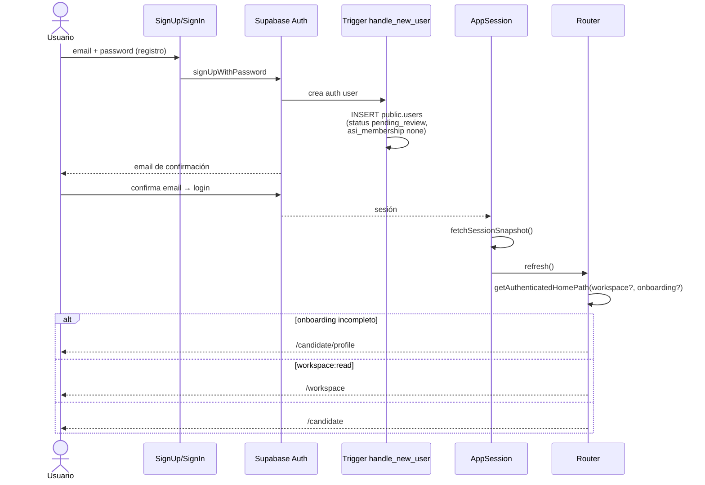
```mermaid
sequenceDiagram
    actor U as Usuario
    participant UI as SignUp/SignIn
    participant SB as Supabase Auth
    participant TRG as Trigger handle_new_user
    participant SES as AppSession
    participant RT as Router

    U->>UI: email + password (registro)
    UI->>SB: signUpWithPassword
    SB->>TRG: crea auth user
    TRG->>TRG: INSERT public.users<br/>(status pending_review,<br/>asi_membership none)
    SB-->>U: email de confirmación
    U->>SB: confirma email → login
    SB-->>SES: sesión
    SES->>SES: fetchSessionSnapshot()
    SES->>RT: refresh()
    RT->>RT: getAuthenticatedHomePath(workspace?, onboarding?)
    alt onboarding incompleto
        RT-->>U: /candidate/profile
    else workspace:read
        RT-->>U: /workspace
    else
        RT-->>U: /candidate
    end
```

**Onboarding base** = `full_name` + `display_name` + `locale ∈ {es,en}` + `country_code` (2 letras).
Mientras falte, `RequireCompletedBaseOnboarding` fuerza `/candidate/profile`.

🗂️ **Estructura de tablas:** [`users`](arquitectura-db.md#users)

---

## 6. Gating del ATS

El "ATS" (área autenticada productiva) se desbloquea solo con **membresía activa**.

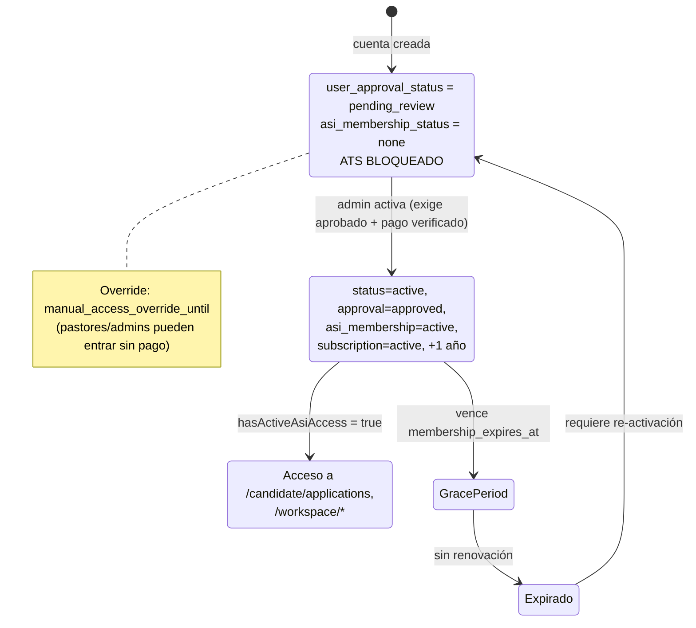
```mermaid
stateDiagram-v2
    [*] --> Pendiente: cuenta creada
    Pendiente: user_approval_status = pending_review<br/>asi_membership_status = none<br/>ATS BLOQUEADO
    Pendiente --> Activo: admin activa (exige aprobado + pago verificado)
    Activo: status=active, approval=approved,<br/>asi_membership=active,<br/>subscription=active, +1 año
    Activo --> ATS: hasActiveAsiAccess = true
    ATS: Acceso a /candidate/applications,<br/>/workspace/*
    Activo --> GracePeriod: vence membership_expires_at
    GracePeriod --> Expirado: sin renovación
    Expirado --> Pendiente: requiere re-activación
    note right of Pendiente
        Override: manual_access_override_until
        (pastores/admins pueden entrar sin pago)
    end note
```

`hasActiveAsiAccess(profile)` = (approval=approved **y** asi_membership=active **y** subscription=active
**y** no vencido) **o** `manual_access_override_until` vigente.

🗂️ **Estructura de tablas:** [`users`](arquitectura-db.md#users) (flags `user_approval_status`, `asi_membership_status`, `user_subscription_status`, `membership_expires_at`, `manual_access_override_until`)

---

## 7. Pipeline de membresía

El carril central. **Separación de funciones**: quien solicita ≠ quien aprueba ≠ quien verifica el
pago ≠ quien activa.

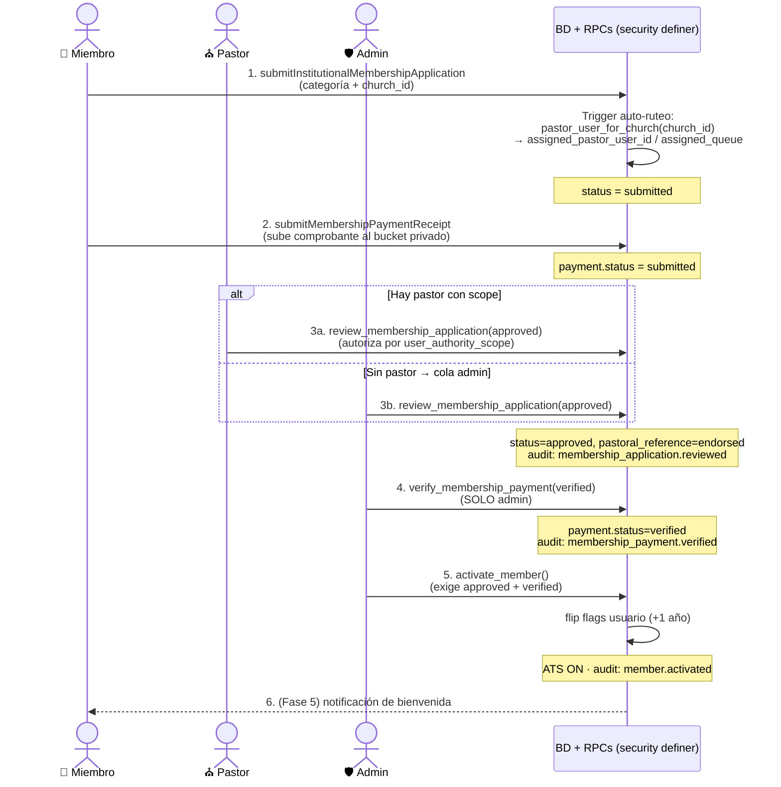
```mermaid
sequenceDiagram
    actor M as 🧑 Miembro
    actor P as ⛪ Pastor
    actor A as 🛡️ Admin
    participant DB as BD + RPCs (security definer)

    M->>DB: 1. submitInstitutionalMembershipApplication<br/>(categoría + church_id)
    DB->>DB: Trigger auto-ruteo:<br/>pastor_user_for_church(church_id)<br/>→ assigned_pastor_user_id / assigned_queue
    Note over DB: status = submitted

    M->>DB: 2. submitMembershipPaymentReceipt<br/>(sube comprobante al bucket privado)
    Note over DB: payment.status = submitted

    alt Hay pastor con scope
        P->>DB: 3a. review_membership_application(approved)<br/>(autoriza por user_authority_scope)
    else Sin pastor → cola admin
        A->>DB: 3b. review_membership_application(approved)
    end
    Note over DB: status=approved, pastoral_reference=endorsed<br/>audit: membership_application.reviewed

    A->>DB: 4. verify_membership_payment(verified)<br/>(SOLO admin)
    Note over DB: payment.status=verified<br/>audit: membership_payment.verified

    A->>DB: 5. activate_member()<br/>(exige approved + verified)
    DB->>DB: flip flags usuario (+1 año)
    Note over DB: ATS ON · audit: member.activated
    DB-->>M: 6. (Fase 5) notificación de bienvenida
```

**Variantes / loops:**

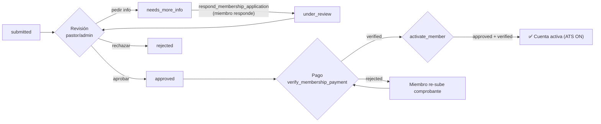
```mermaid
flowchart LR
    SUB["submitted"] --> REV{"Revisión<br/>pastor/admin"}
    REV -->|"aprobar"| APP["approved"]
    REV -->|"pedir info"| NMI["needs_more_info"]
    REV -->|"rechazar"| REJ["rejected"]
    NMI -->|"respond_membership_application<br/>(miembro responde)"| UR["under_review"]
    UR --> REV
    APP --> VPAY{"Pago<br/>verify_membership_payment"}
    VPAY -->|"verified"| ACT{"activate_member"}
    VPAY -->|"rejected"| RESUB["Miembro re-sube comprobante"]
    RESUB --> VPAY
    ACT -->|"approved + verified"| ON["✅ Cuenta activa (ATS ON)"]
```

🗂️ **Estructura de tablas:** [`institutional_membership_applications`](arquitectura-db.md#institutional_membership_applications) · [`membership_payments`](arquitectura-db.md#membership_payments) · [`user_authority_scopes`](arquitectura-db.md#user_authority_scopes) · [`churches`](arquitectura-db.md#churches) · [`audit_logs`](arquitectura-db.md#audit_logs)

---

## 8. Flujo del MIEMBRO

Panel de progreso guiado (`/account/membership`) con 4 pasos en vivo.

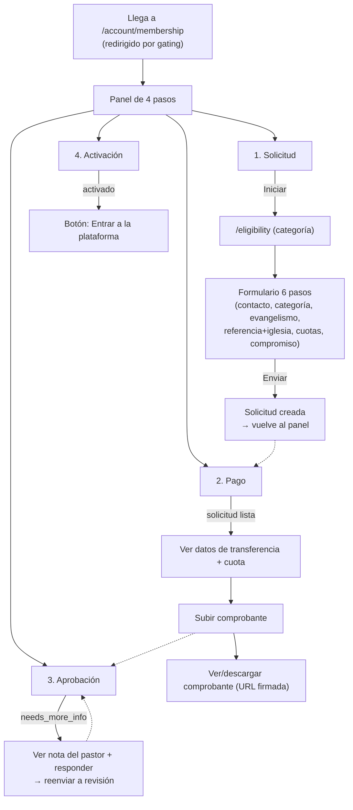
```mermaid
flowchart TD
    LAND["Llega a /account/membership<br/>(redirigido por gating)"] --> STEPS["Panel de 4 pasos"]
    STEPS --> S1["1. Solicitud"]
    STEPS --> S2["2. Pago"]
    STEPS --> S3["3. Aprobación"]
    STEPS --> S4["4. Activación"]

    S1 -->|"Iniciar"| ELG["/eligibility (categoría)"]
    ELG --> FORM["Formulario 6 pasos<br/>(contacto, categoría, evangelismo,<br/>referencia+iglesia, cuotas, compromiso)"]
    FORM -->|"Enviar"| OKSUB["Solicitud creada<br/>→ vuelve al panel"]

    S2 -->|"solicitud lista"| TRANSF["Ver datos de transferencia + cuota"]
    TRANSF --> UPL["Subir comprobante"]
    UPL --> VIEW["Ver/descargar comprobante (URL firmada)"]

    S3 -->|"needs_more_info"| NOTE["Ver nota del pastor + responder<br/>→ reenviar a revisión"]

    S4 -->|"activado"| ENTER["Botón: Entrar a la plataforma"]

    OKSUB -.-> S2
    UPL -.-> S3
    NOTE -.-> S3
```

Estados que ve el miembro por paso: `Enviada / En revisión / Falta información / Aprobada / Rechazada`
(solicitud) y `Comprobante recibido / Pago verificado / Comprobante rechazado` (pago).

🗂️ **Estructura de tablas:** [`institutional_membership_applications`](arquitectura-db.md#institutional_membership_applications) · [`membership_payments`](arquitectura-db.md#membership_payments) · [`membership_payment_settings`](arquitectura-db.md#membership_payment_settings)

---

## 9. Flujo del PASTOR

Un pastor primero **obtiene alcance**, luego **revisa la cola** de sus iglesias.

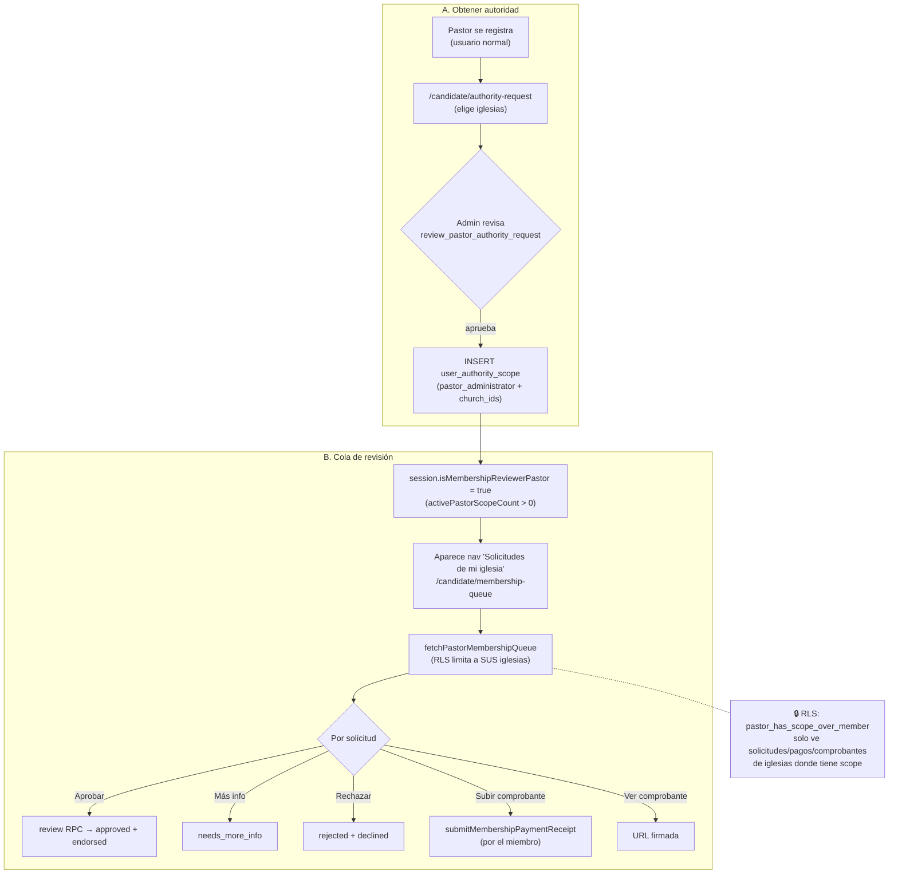
```mermaid
flowchart TD
    subgraph ALTA["A. Obtener autoridad"]
        REG["Pastor se registra<br/>(usuario normal)"] --> AREQ["/candidate/authority-request<br/>(elige iglesias)"]
        AREQ --> ADMINREV{"Admin revisa<br/>review_pastor_authority_request"}
        ADMINREV -->|"aprueba"| SCOPE["INSERT user_authority_scope<br/>(pastor_administrator + church_ids)"]
    end

    subgraph COLA["B. Cola de revisión"]
        SCOPE --> DETECT["session.isMembershipReviewerPastor = true<br/>(activePastorScopeCount > 0)"]
        DETECT --> NAV["Aparece nav 'Solicitudes de mi iglesia'<br/>/candidate/membership-queue"]
        NAV --> QUEUE["fetchPastorMembershipQueue<br/>(RLS limita a SUS iglesias)"]
        QUEUE --> ACTIONS{"Por solicitud"}
        ACTIONS -->|"Aprobar"| APR["review RPC → approved + endorsed"]
        ACTIONS -->|"Más info"| MI["needs_more_info"]
        ACTIONS -->|"Rechazar"| RJ["rejected + declined"]
        ACTIONS -->|"Subir comprobante"| UPB["submitMembershipPaymentReceipt<br/>(por el miembro)"]
        ACTIONS -->|"Ver comprobante"| VC["URL firmada"]
    end

    note1["🔒 RLS: pastor_has_scope_over_member<br/>solo ve solicitudes/pagos/comprobantes<br/>de iglesias donde tiene scope"]
    QUEUE -.- note1
```

> El pastor **no** puede verificar pagos ni activar (eso es admin). Solo aprueba la **referencia
> pastoral**.

🗂️ **Estructura de tablas:** [`pastor_authority_requests`](arquitectura-db.md#pastor_authority_requests) · [`user_authority_scopes`](arquitectura-db.md#user_authority_scopes) · [`institutional_membership_applications`](arquitectura-db.md#institutional_membership_applications) · [`membership_payments`](arquitectura-db.md#membership_payments)

---

## 10. Flujo del ADMIN

El admin tiene visibilidad y control total. Surfaces bajo `/admin`.

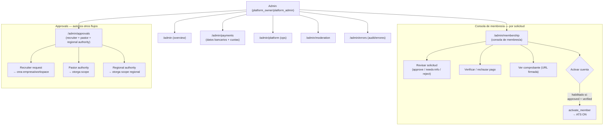
```mermaid
flowchart TB
    ADMIN["Admin (platform_owner/platform_admin)"] --> OVERVIEW["/admin (overview)"]
    ADMIN --> APPROV["/admin/approvals<br/>(recruiter + pastor + regional authority)"]
    ADMIN --> MEMBCON["/admin/membership<br/>(consola de membresía)"]
    ADMIN --> PAYSET["/admin/payments<br/>(datos bancarios + cuotas)"]
    ADMIN --> PLAT["/admin/platform (ops)"]
    ADMIN --> MOD["/admin/moderation"]
    ADMIN --> ERR["/admin/errors (audit/errores)"]

    subgraph CONSOLE["Consola de membresía — por solicitud"]
        MEMBCON --> C1["Revisar solicitud<br/>(approve / needs-info / reject)"]
        MEMBCON --> C2["Verificar / rechazar pago"]
        MEMBCON --> C3["Ver comprobante (URL firmada)"]
        MEMBCON --> C4{"Activar cuenta"}
        C4 -->|"habilitado si:<br/>approved + verified"| ACTV["activate_member<br/>→ ATS ON"]
    end

    subgraph APPROVALS["Approvals — autoriza otros flujos"]
        APPROV --> R1["Recruiter request<br/>→ crea empresa/workspace"]
        APPROV --> R2["Pastor authority<br/>→ otorga scope"]
        APPROV --> R3["Regional authority<br/>→ otorga scope regional"]
    end
```

🗂️ **Estructura de tablas:** [`institutional_membership_applications`](arquitectura-db.md#institutional_membership_applications) · [`membership_payments`](arquitectura-db.md#membership_payments) · [`membership_payment_settings`](arquitectura-db.md#membership_payment_settings) · [`recruiter_requests`](arquitectura-db.md#recruiter_requests) · [`pastor_authority_requests`](arquitectura-db.md#pastor_authority_requests) · [`regional_administrator_authority_requests`](arquitectura-db.md#regional_administrator_authority_requests) · [`audit_logs`](arquitectura-db.md#audit_logs)

---

## 11. Conversión a EMPLEADOR

Un candidato puede convertirse en empleador solicitando reclutar con su empresa.

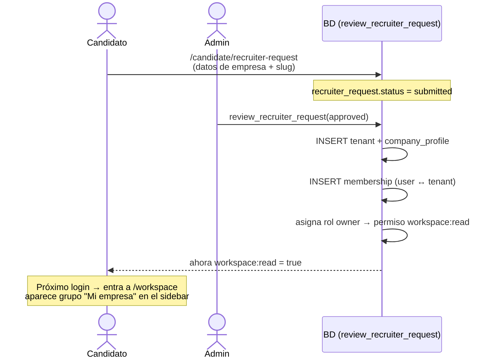
```mermaid
sequenceDiagram
    actor C as Candidato
    actor A as Admin
    participant DB as BD (review_recruiter_request)

    C->>DB: /candidate/recruiter-request<br/>(datos de empresa + slug)
    Note over DB: recruiter_request.status = submitted
    A->>DB: review_recruiter_request(approved)
    DB->>DB: INSERT tenant + company_profile
    DB->>DB: INSERT membership (user ↔ tenant)
    DB->>DB: asigna rol owner → permiso workspace:read
    DB-->>C: ahora workspace:read = true
    Note over C: Próximo login → entra a /workspace<br/>aparece grupo "Mi empresa" en el sidebar
```

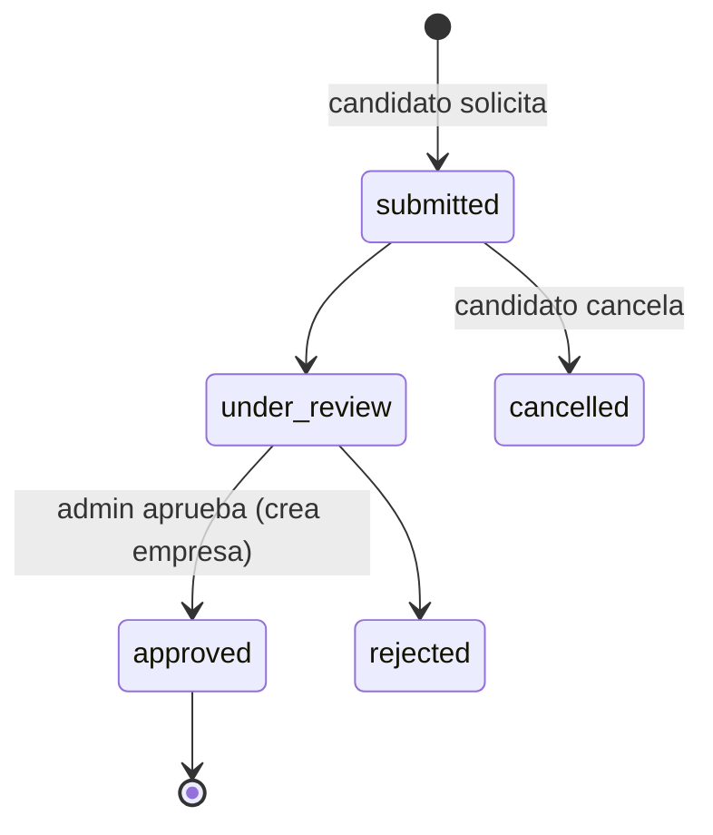
```mermaid
stateDiagram-v2
    [*] --> submitted: candidato solicita
    submitted --> under_review
    under_review --> approved: admin aprueba (crea empresa)
    under_review --> rejected
    submitted --> cancelled: candidato cancela
    approved --> [*]
```

🗂️ **Estructura de tablas:** [`recruiter_requests`](arquitectura-db.md#recruiter_requests) · [`tenants`](arquitectura-db.md#tenants) · [`company_profiles`](arquitectura-db.md#company_profiles) · [`memberships`](arquitectura-db.md#memberships) · [`tenant_roles`](arquitectura-db.md#tenant_roles)

---

## 12. Flujo de EMPLEO

Dos lados: el **candidato** que aplica y el **empleador** que gestiona el pipeline.

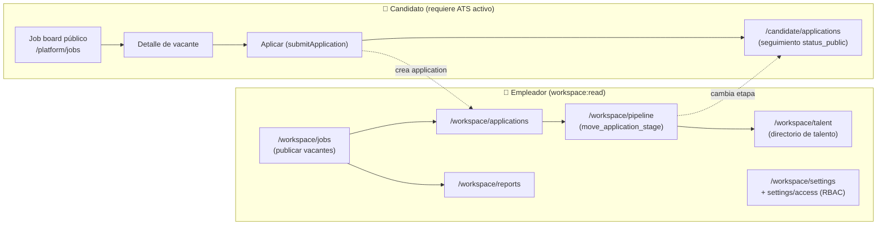
```mermaid
flowchart LR
    subgraph CANDIDATE["🧑 Candidato (requiere ATS activo)"]
        BOARD["Job board público<br/>/platform/jobs"] --> JOB["Detalle de vacante"]
        JOB --> APPLY2["Aplicar (submitApplication)"]
        APPLY2 --> TRACK["/candidate/applications<br/>(seguimiento status_public)"]
    end

    subgraph EMPLOYER["🏢 Empleador (workspace:read)"]
        WJOBS["/workspace/jobs<br/>(publicar vacantes)"] --> WAPP["/workspace/applications"]
        WAPP --> PIPE["/workspace/pipeline<br/>(move_application_stage)"]
        PIPE --> TALENT["/workspace/talent<br/>(directorio de talento)"]
        WJOBS --> REPORTS["/workspace/reports"]
        WSET["/workspace/settings<br/>+ settings/access (RBAC)"]
    end

    APPLY2 -.->|"crea application"| WAPP
    PIPE -.->|"cambia etapa"| TRACK
```

Etapas del pipeline: definidas en `pipeline_stages`; el movimiento se registra en
`application_stage_history` vía `move_application_stage`.

🗂️ **Estructura de tablas:** [`job_postings`](arquitectura-db.md#job_postings) · [`applications`](arquitectura-db.md#applications) · [`pipeline_stages`](arquitectura-db.md#pipeline_stages) · [`application_stage_history`](arquitectura-db.md#application_stage_history) · [`saved_jobs`](arquitectura-db.md#saved_jobs) · [`candidate_profiles`](arquitectura-db.md#candidate_profiles)

---

## 13. Máquinas de estado (todas)

### Solicitud de membresía (`review_workflow_status`)
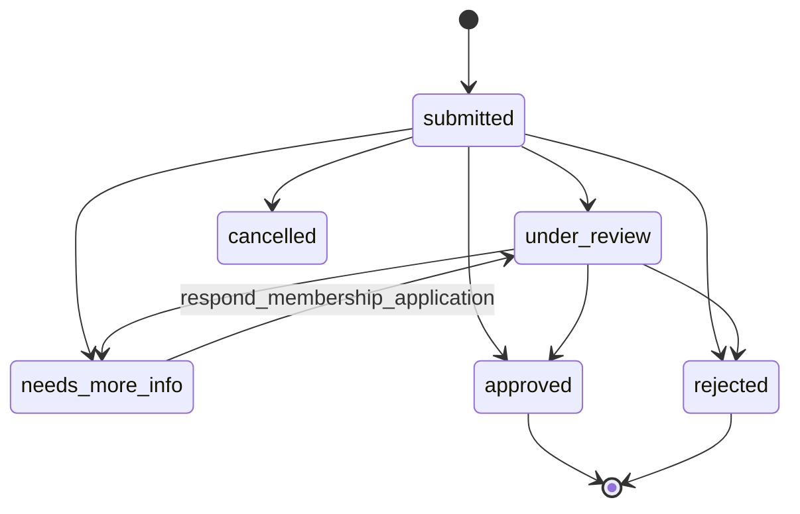
```mermaid
stateDiagram-v2
    [*] --> submitted
    submitted --> under_review
    submitted --> needs_more_info
    submitted --> approved
    submitted --> rejected
    under_review --> approved
    under_review --> needs_more_info
    under_review --> rejected
    needs_more_info --> under_review: respond_membership_application
    approved --> [*]
    rejected --> [*]
    submitted --> cancelled
```

### Pago de membresía (`membership_payment_status`)
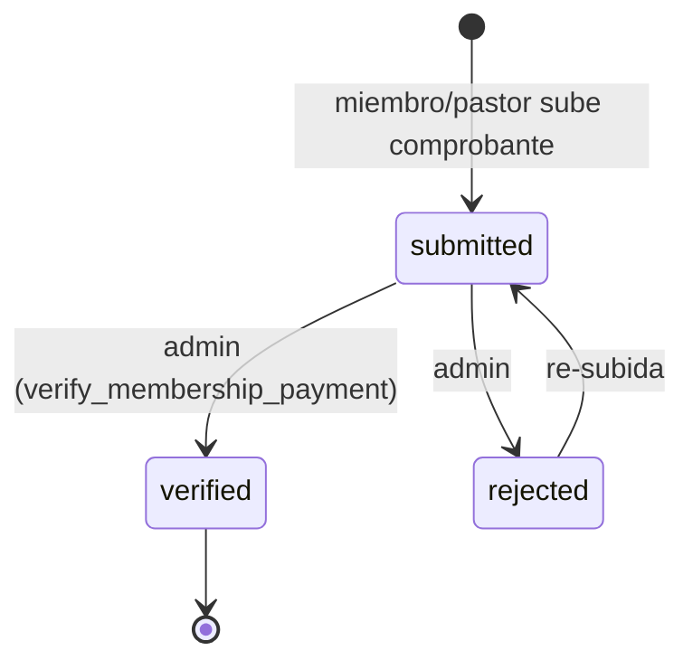
```mermaid
stateDiagram-v2
    [*] --> submitted: miembro/pastor sube comprobante
    submitted --> verified: admin (verify_membership_payment)
    submitted --> rejected: admin
    rejected --> submitted: re-subida
    verified --> [*]
```

### Referencia pastoral (`pastoral_reference_status`)
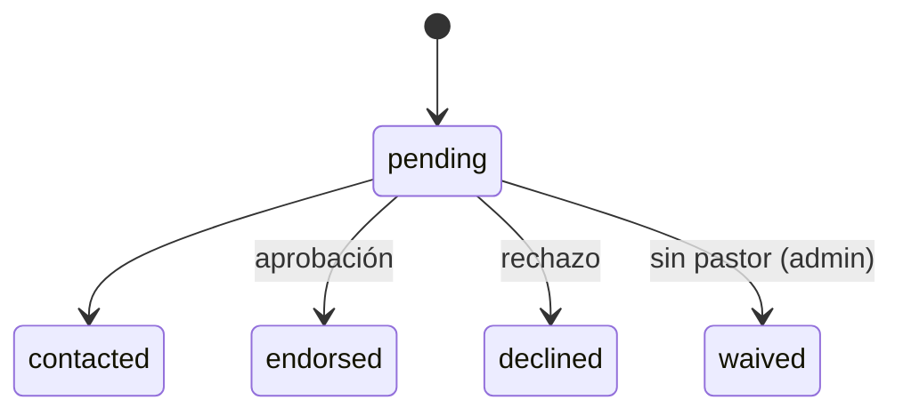
```mermaid
stateDiagram-v2
    [*] --> pending
    pending --> contacted
    pending --> endorsed: aprobación
    pending --> declined: rechazo
    pending --> waived: sin pastor (admin)
```

### Cuenta / membresía ASI (`asi_membership_status`)
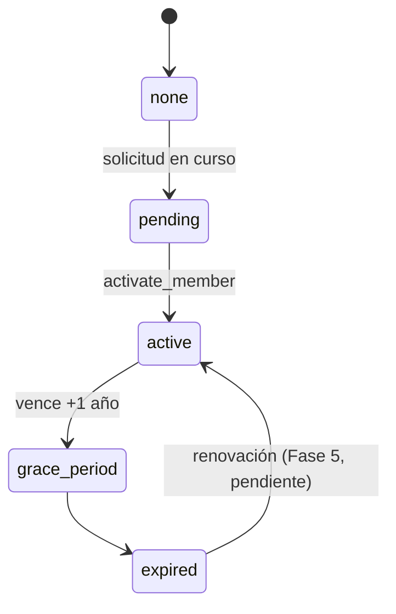
```mermaid
stateDiagram-v2
    [*] --> none
    none --> pending: solicitud en curso
    pending --> active: activate_member
    active --> grace_period: vence +1 año
    grace_period --> expired
    expired --> active: renovación (Fase 5, pendiente)
```

### Autoridad territorial (`authority_scope_status`)
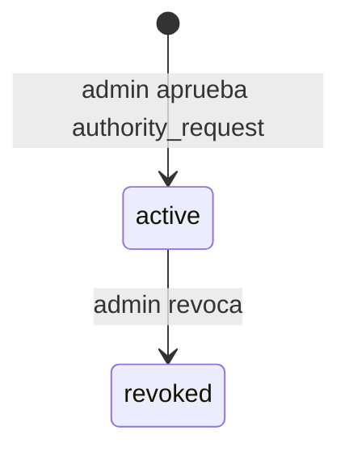
```mermaid
stateDiagram-v2
    [*] --> active: admin aprueba authority_request
    active --> revoked: admin revoca
```

🗂️ **Estructura de tablas:** [`institutional_membership_applications`](arquitectura-db.md#institutional_membership_applications) · [`membership_payments`](arquitectura-db.md#membership_payments) · [`user_authority_scopes`](arquitectura-db.md#user_authority_scopes) · [`recruiter_requests`](arquitectura-db.md#recruiter_requests) · [`users`](arquitectura-db.md#users)

---

## 14. Navegación por rol (qué ve cada quién)

```mermaid
flowchart TB
    subgraph SIDEBAR["Sidebar unificado (PlatformAppShell)"]
        BASE["📁 Tu espacio<br/>Inicio · Empleos · Aplicaciones · Perfil"]
        PASTORAL["⛪ Pastoral<br/>Solicitudes de mi iglesia<br/>(solo si isMembershipReviewerPastor)"]
        EMPRESA["🏢 Mi empresa<br/>Resumen · Vacantes · Aplicaciones · Pipeline ·<br/>Talento · Reportes · Config<br/>(solo si workspace:read)"]
        ADM["🛡️ Administración<br/>Overview · Approvals · Membresía · Datos de pago ·<br/>Platform · Moderation · Errors<br/>(solo si canAccessAdminConsole)"]
        CUENTA["👤 Cuenta<br/>Reclutar con mi empresa · Autorización territorial"]
    end
```

| Rol | Tu espacio | Pastoral | Mi empresa | Administración |
|---|:---:|:---:|:---:|:---:|
| Candidato (activo) | ✅ | — | — | — |
| Pastor | ✅ | ✅ | — | — |
| Empleador | ✅ | — | ✅ | — |
| Admin | ✅ | (si scope) | (si empresa) | ✅ |
| Pendiente (sin activar) | solo `/account/membership` | — | — | — |

---

## 15. Matriz de permisos y RPCs

| Acción | Quién | Permiso / autorización | RPC / función | Audita |
|---|---|---|---|---|
| Enviar solicitud | Miembro | RLS `requester = auth.uid()` | `submitInstitutionalMembershipApplication` | — |
| Auto-ruteo a pastor | Sistema | trigger | `pastor_user_for_church` | — |
| Subir comprobante | Miembro / Pastor | RLS dueño / `pastor_has_scope_over_member` | `submitMembershipPaymentReceipt` | — |
| Responder "falta info" | Miembro | RLS `requester = auth.uid()` | `respond_membership_application` | ✅ |
| Revisar solicitud | Pastor / Admin | scope pastoral **o** `is_platform_admin` | `review_membership_application` | ✅ |
| Verificar pago | Admin | `is_platform_admin` | `verify_membership_payment` | ✅ |
| Activar cuenta | Admin | `is_platform_admin` + (approved+verified) | `activate_member` | ✅ |
| Aprobar recruiter | Admin | `recruiter_request:review` | `review_recruiter_request` | ✅ |
| Otorgar autoridad pastor | Admin | `pastor_authority_request:review` | `review_pastor_authority_request` | ✅ |
| Otorgar autoridad regional | Admin | `regional_authority_request:review` | `review_regional_authority_request` | ✅ |
| Editar datos bancarios/cuotas | Admin | `is_platform_admin` (RLS) | `updateMembershipPaymentSettings` | — |
| Mover etapa de aplicación | Empleador | `application:read`/tenant | `move_application_stage` | ✅ |

🗂️ **Estructura de tablas:** ver todas en **[Arquitectura de base de datos](arquitectura-db.md)** — [`institutional_membership_applications`](arquitectura-db.md#institutional_membership_applications) · [`membership_payments`](arquitectura-db.md#membership_payments) · [`membership_payment_settings`](arquitectura-db.md#membership_payment_settings) · [`user_authority_scopes`](arquitectura-db.md#user_authority_scopes) · [`recruiter_requests`](arquitectura-db.md#recruiter_requests) · [`audit_logs`](arquitectura-db.md#audit_logs)

---

## Pendientes conocidos (no implementados)

- **Fase 5 — Notificaciones**: la infraestructura existe (`notifications`, `send-notification`,
  `process-email-deliveries` con Resend, centro de notificaciones), pero **ninguna transición de
  membresía la dispara**. Faltan: nueva solicitud→pastor, comprobante→admin, decisión→miembro,
  activación→miembro.
- **Recordatorios de renovación**: la membresía vence (`membership_expires_at` +1 año) sin aviso ni
  flujo de re-pago.
- **Contenido real (§8)**: cuotas por categoría + datos bancarios son seeds de prueba.

> Diagramas generados desde el código real (rutas, guards, RPCs, RLS y migraciones).
> Para el detalle del pipeline de membresía ver `docs/membership-pipeline-plan.md`.
