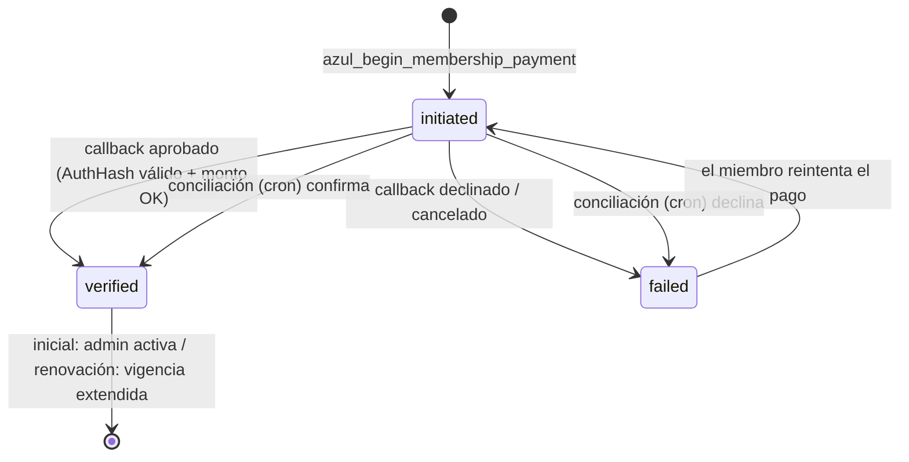
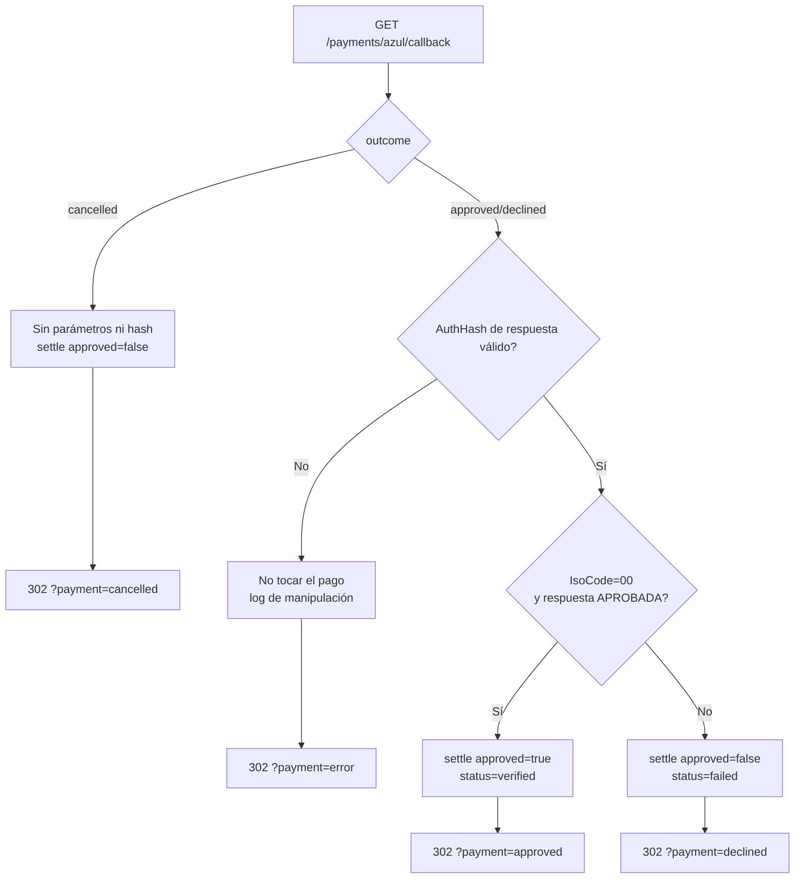

# Flujograma — Pasarela de pagos AZUL (Página de Pago)

Integración del pago de membresía con tarjeta vía la **Página de Pago de AZUL**. El secreto
(`AuthKey`) vive solo en el microservicio `services/azul-payments`; Supabase es la fuente de
verdad (DB + auth + notificaciones).

## Componentes

| Componente | Rol |
|---|---|
| **SPA (Vite/React)** | Inicia el pago y muestra el resultado. No conoce la `AuthKey`. |
| **Microservicio `azul-payments`** (Fastify, Railway/Render) | Firma/verifica el AuthHash (HMAC-SHA512), liquida pagos vía RPC y concilia. |
| **AZUL Payment Page** | Captura la tarjeta y procesa la transacción. |
| **Supabase** | RPCs (`azul_begin_membership_payment`, `azul_settle_membership_payment`), RLS, notificaciones, auditoría. |

## Secuencia principal (pago aprobado)

```mermaid
sequenceDiagram
    autonumber
    actor M as Miembro
    participant SPA as SPA (panel membresía)
    participant SVC as Microservicio azul-payments
    participant DB as Supabase (RPC + DB)
    participant AZ as AZUL Payment Page

    M->>SPA: Clic "Pagar con tarjeta"
    SPA->>SVC: POST /payments/azul/create (Bearer JWT)
    SVC->>DB: rpc azul_begin_membership_payment (JWT del miembro)
    DB-->>SVC: { order_number, amount(DOP), category }
    Note over DB: Valida dueño (auth.uid), cuota desde settings,<br/>INSERT pago status='initiated'
    SVC->>SVC: Calcula AuthHash (vector oficial SALE, AuthKey secreta)
    SVC-->>SPA: { paymentUrl, fields (incl. AuthHash) }
    SPA->>AZ: Auto-POST <form> (navegación full-page)
    M->>AZ: Ingresa tarjeta y confirma
    Note over AZ,M: ShowTransactionResult=1 mantiene visible el comprobante/resultado de AZUL antes del retorno
    AZ-->>SVC: GET /payments/azul/callback?outcome=approved&...&AuthHash=...
    SVC->>SVC: Verifica AuthHash respuesta (UTF-16LE) + IsoCode=00 + monto
    SVC->>DB: rpc azul_settle_membership_payment(order, approved=true, response)
    Note over DB: Idempotente (solo si 'initiated').<br/>UPDATE status='verified', guarda campos AZUL,<br/>audit_log, notifica miembro + admins
    DB-->>SVC: { status: 'verified', member, application }
    SVC-->>M: 302 → /account/membership?payment=approved
    SPA->>SPA: toast + refresca estado (React Query)
    Note over M: Pago inicial: admin activa.<br/>Renovación: DB extiende vigencia automáticamente.
```



## Máquina de estados del pago (`membership_payments.status`)



## Ramas de resultado del callback



## Conciliación server-to-server (cron)

```mermaid
flowchart LR
    T[Cron RECONCILE_CRON] --> Q[Lee pagos 'initiated'<br/>antigüedad > N min]
    Q --> V{Webservice de consulta<br/>AZUL configurado?}
    V -->|No| L[Log para revisión manual<br/>el callback firmado sigue siendo la vía principal]
    V -->|Sí| C[Consulta estado por OrderNumber]
    C --> S[azul_settle_membership_payment<br/>verified | failed]
```

## Garantías de seguridad

- **`AuthKey` nunca en el browser ni en la DB** — solo en el secret store del microservicio.
- **Verificación del AuthHash de respuesta** (firmado por AZUL) antes de marcar `verified`:
  impide que un usuario falsifique un "Approved".
- **Verificación de monto**: el `Amount` devuelto debe coincidir con el cobrado (anti-tamper).
- **Idempotencia**: `azul_settle_membership_payment` solo actúa sobre pagos `initiated`.
- **No se almacenan datos de tarjeta** (requisito de AZUL).
- **Activación admin** se conserva para membresía inicial (`activate_member`); una renovación aprobada
  de un miembro ya activo extiende la vigencia automáticamente desde la fecha vigente.
